# Path planning using imitation learning

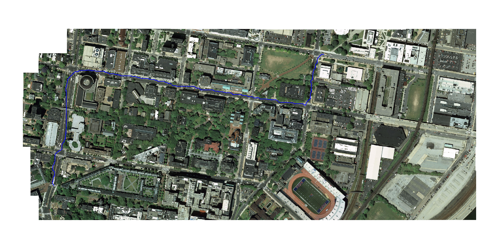

This project involves finding the shortest path between two points in an aerial map of the Penn campus. This was done for two modalities: vehicles and pedestrians. Imitation learning, specifically an exponentiated functional gradient descent algorithm (LEARCH [1]) was used to learn the cost map given the training paths drawn by an expert. LEARCH tries to imitate the expert policy and updates the cost map iteratively such that the planned path becomes closer to the desired expert path. Loss augmentation is incorporated for getting better and generalized results during testing. This is in line with the philosophy of learning difficult problems so that solving future problems becomes easier. Support Vector Regression (SVR) was used to regress upon the features for the planned and desired paths and the predictions were used to update the log cost map.

This project was done as a part of ESE650 Learning in Robotics, University of Pennsylvania in the spring of 2015.

Traditionally, planning algorithms rely on cost functions that map sensor readings and environmental models of robots to quantify costs. Such cost functions are manually designed and programmed. In this project, we use imitation learning to learn the cost function from human demonstrations and then use standard planning algorithms like A\* or Dijkstra's to find the shortest path from the learned cost map.

Seven paths are plotted in the aerial map for each of the two modalities: vehicle planning and pedestrian planning. This serves as the expert paths. The idea is that if there's a shorter path from point A to B which includes footpaths, planning for the pedestrian should return that path. Vehicles should traverse paths that are allowed, for eg. roads and bridges and not footpaths.
The cost function to be learned is a function of features. Feature masks are extracted from the map that directly or indirectly contribute to the cost. For example, features like grey pixels might be representative of roads. That corresponds to a lower cost. Pixels for buildings correspond to higher costs.
The aim is to increase the cost of points along the planned path and decrease the cost of points along the desired paths drawn by an expert.
Learning is made harder, better and more generalized by using a loss augmented cost map.
`loss augmented cost map = cost map - loss map`

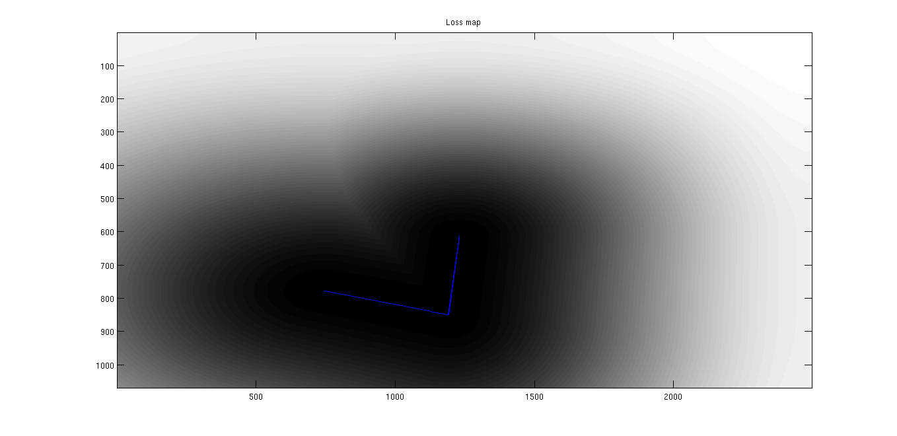

This shows the loss map for a desired path in blue. Area near the desired path is closer to 0 and the rest of the map is closer to 1. The cost map is modified such that desired paths have a higher cost and the rest of the map has a lower cost. This is achieved with a 2D hamming window.
Intuitively, a loss augmented cost map tries to achieve the max margin property of SVM loss by forcing the learning algorithm to continue updating the cost function until the cost of the desired path is significantly lower than any other path. Doing this generalizes well and is more robust, even in the face of less expert paths collected.

Algorithm 5 from [1] is implemented in this project. A log cost map is initialized to zero. A log is taken to enforce a positive constraint which is needed in some planning algorithms. For each expert training path, a loss augmented costmap is computed and the planned path is found using Dijkstra's algorithm. The expert training paths are desired and labeled negative (want to lower cost). The planned paths are labeled positive (want higher cost). A SVR model is used to learn the mapping between the features and the cost such that predictions for features corresponding to the desired paths are lower and predictions for features corresponding to the planned paths are higher. Predicting lower cost for the expert paths should also lower the cost of similar features. For example, an expert path can only cover a small section of the road. Similar features elsewhere however will have their cost lowered too. The prediction is then made for every feature vector in the map and this is used to update the log cost map. This process is repeated until the planned path is closer to the desired path.

More information can be found in the [report](./report/project5.pdf)

**Original aerial image of the Penn campus**
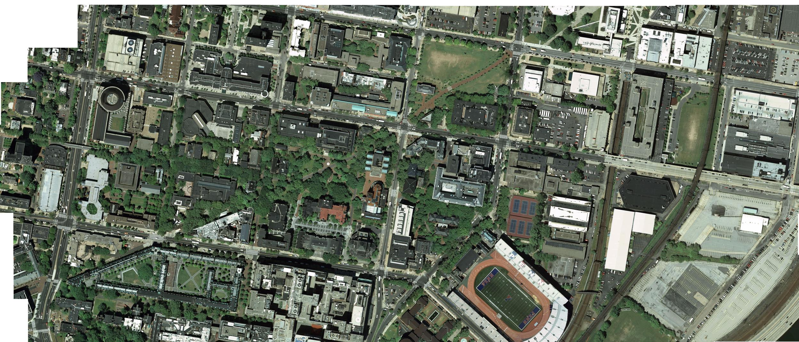

**Cost map learned for vehicle mode**
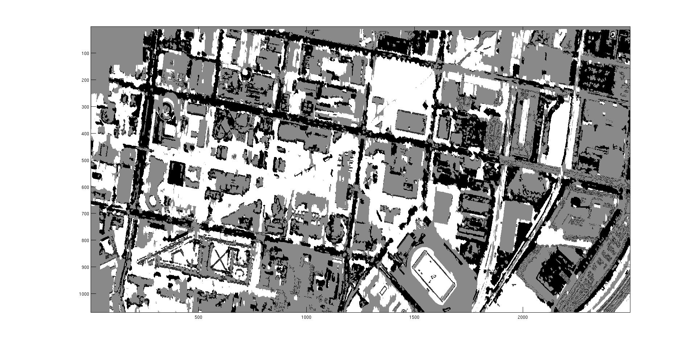

**Cost map learned for pedestrian mode**
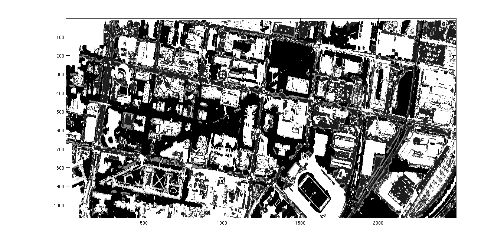

Once can observe that pathways between buildings have lower cost for pedestrians.

## Results

**Vehicle mode**

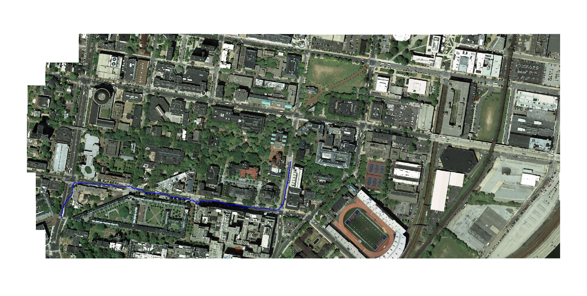
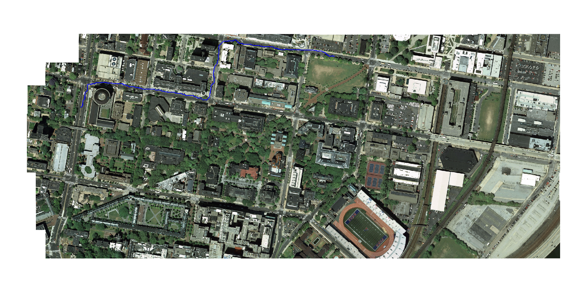
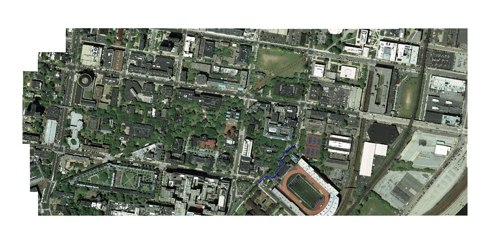
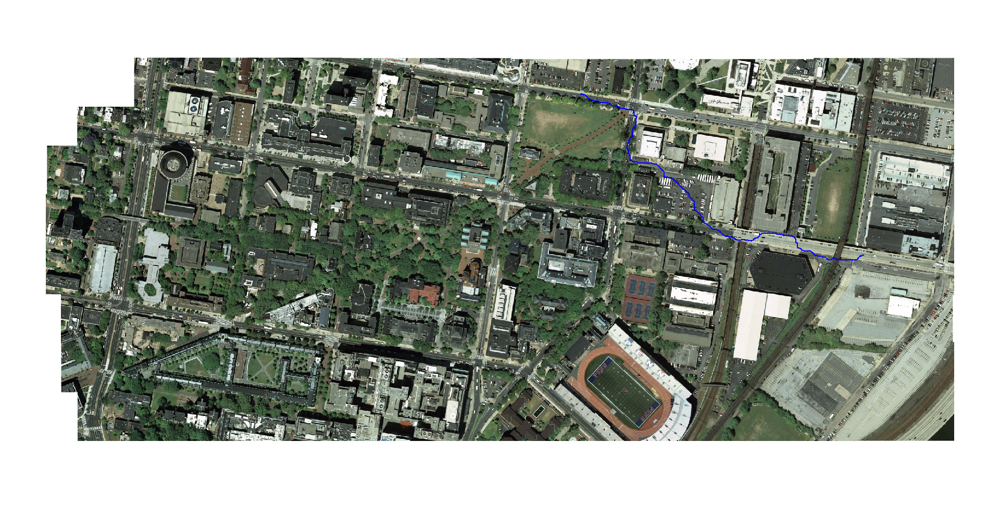
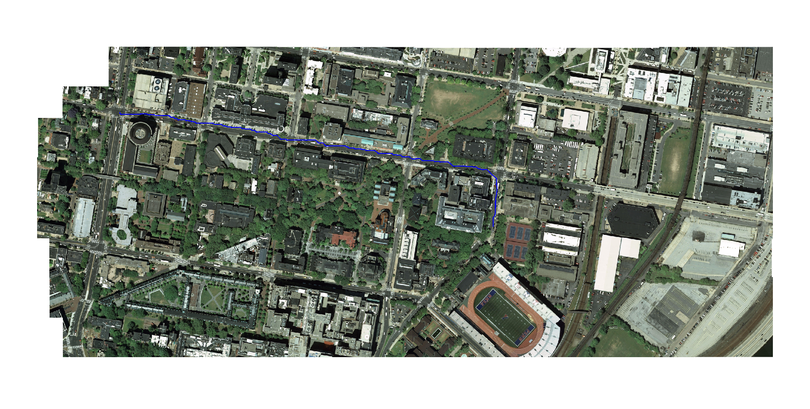

**Pedestrian mode**
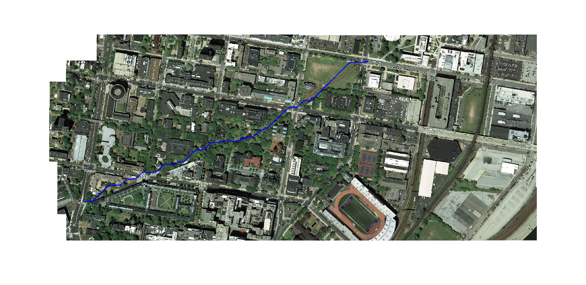
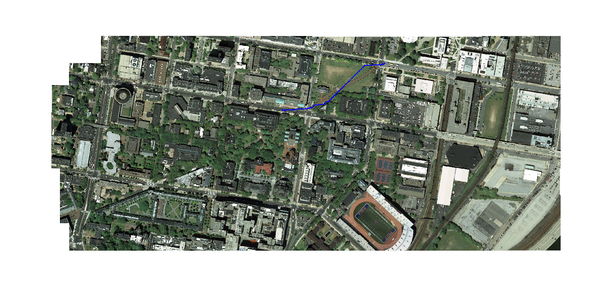
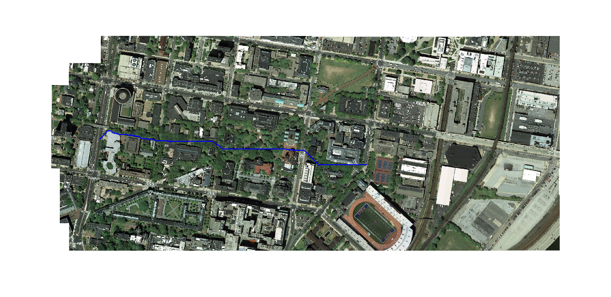
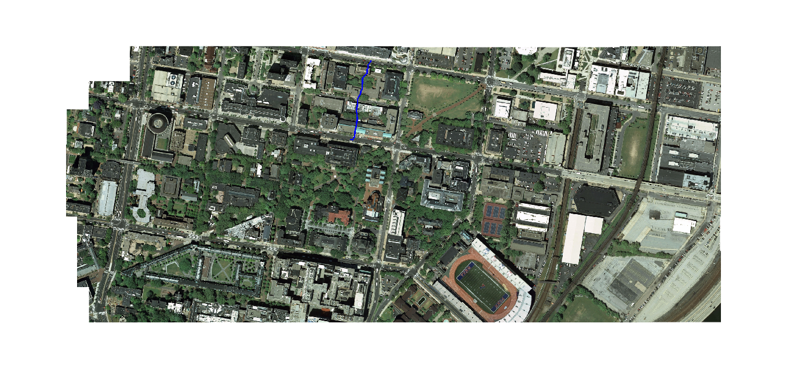

## References

1. [Nathan D. Ratliff, David Silver, J. Andrew Bagnell. Learning to Search: Functional Gradient Techniques for Imitation Learning](https://www.ri.cmu.edu/pub_files/2009/7/learch.pdf)

2. [R.-E. Fan, K.-W. Chang, C.-J. Hsieh, X.-R. Wang, and C.-J. Lin. LIBLINEAR: A library for large linear classification Journal of Machine Learning Research 9(2008), 1871-1874.](https://www.csie.ntu.edu.tw/~cjlin/liblinear/)
